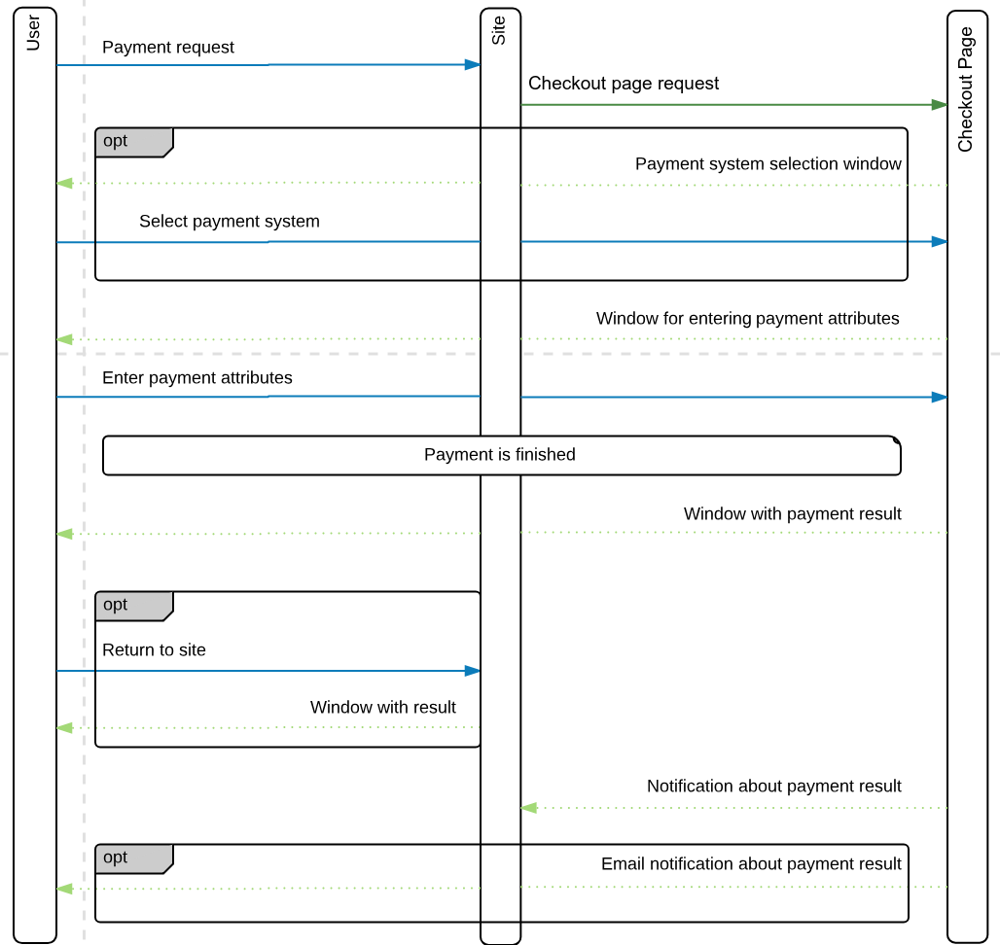

# 1D3 checkout page SDK

This is a set of libraries in the Go language to ease integration of your service
with the 1D3 Checkout Page.

## Payment flow



### Installation

Simply use go get:

`go get github.com/dev1d3/checkoutpage-sdk-go`

To update later:

`go get -u github.com/dev1d3/checkoutpage-sdk-go`

### Get URL for payment

```go
import "github.com/dev1d3/checkoutpage-sdk-go"

payment := checkoutpage.NewPayment(11, "test_payment_id")
payment.SetParam(checkoutpage.ParamPaymentCurrency, "EUR")
payment.SetParam(checkoutpage.ParamPaymentAmount, 1000)

gate := checkoutpage.NewGate("your project secret")
checkoutPageUrl := gate.GetCheckoutPageUrl(*payment)
``` 

`checkoutPageUrl` here is the signed URL.

### Handle callback from 1D3

You'll need to autoload this code in order to handle notifications:

```go
import "github.com/dev1d3/checkoutpage-sdk-go"

gate := checkoutpage.NewGate("your project secret")
callback, err := gate.HandleCallback(data)
```

`data` is the JSON string received from payment system;

`err` nil or error interface; error returned if signature invalid or callback data can't parse;

`callback` is the Callback object describing properties received from payment system;
`callback` implements these methods: 
1. `callback.GetPaymentStatus()`
    Get payment status.
2. `callback.GetPayment()`
    Get all payment data.
3. `callback.GetPaymentId()`
    Get payment ID in your system.
